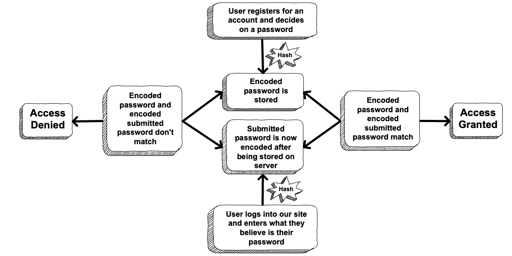

.. _hashing-passwords:

Hashing Passwords
=================

.. index:: ! password hashing

Simple authentication allows users to log in to a site with a username and password. To implement authentication, we need to be able to verify that a user's password is correct. However, **you should NEVER store passwords in a database.** Seriously. Don't do it. Ever.

Storing passwords in a database is incredibly insecure. A hacker may break into the database, gaining access to every user account. Or a deviant employee with access to the database may do the same. 

Fortunately, it is possible for us to implement simple authentication *without* storing passwords, by using a technique called **password hashing**. Password hashing is a particular type of encryption that we will explore throughout the rest of this section.

Two-Way Encryption
------------------

.. index::
   single: encryption; two-way

When you think of encryption, you might think of WWII or the Cold War, when the militaries of various countries exchanged secret messages that were unreadable by their enemies. This type of encryption is **two-way encryption**. A message is *encoded* with a key before being sent, and when it is received, it is *decoded* by another key. 

.. figure:: figures/two-way-encryption.png
   :alt: A two-way encryption flow. A key is used to encrypt sensitive data. After being transmitted, another key decrypts it. 

   Two-way encryption (Created by Munkhzaya Ganbold, licensed via `CC BY-SA <https://creativecommons.org/licenses/by-sa/4.0/deed.en>`_)

One-Way Encryption
------------------

.. index::
   single: encryption; one-way

.. index:: ! hashing, ! hash function

**One-way encryption**, also known as **hashing**, encodes a message in a way that makes it *nearly* impossible to decode. An algorithm implementing a one-way encryption algorithm is a **cryptographic hash function** (we'll usually leave off "cryptographic"). For a specific message, the output of a hash function is a **hash**. 

The hashing process is essentially just the top half of the diagram above. While it might not be clear yet, hashing allows us to securely store passwords and still be able to validate a user's submitted password. Precisely *how* this is done will be explored in a moment.
The diagram below shows the general flow of how hashing works to secure the site.

   Diagram showing how encoded passwords are compared to a submitted password to authenticate a user.

It can be difficult to write a good hash function, so thankfully you will never have to. Over the years, some very smart people have created some very good hash functions. However, it is important to understand how the properties of a hash function allow for secure password storage. For our purposes, it is only important that we consider a hash function to have these properties:

.. _hash_properties:

#. **Deterministic**: If we encode a message with the function at different points in time then we always get the same result.
#. **Hard to reverse**: It is infeasible to calculate the input value that yields a given hash.
#. **Hash values are ALMOST unique**: If ``a`` and ``b`` are two different messages, then is is *extremely* unlikely that they have the same hash value. By "extremely unlikely" we mean that this is something like a one-in-a-trillion likelihood (for example, there are only about 8 billion people on earth). 
#. **Similar messages have VERY different hash values**: In other words, if we change a message only slightly, the resulting hash value is *very* different. A function that returned ``AlXL3M_ws`` for the message ``"LaunchCode"`` and ``AlXL3M_wt`` for the message ``"LaunchCodf"`` would not be a suitable hash function. 

Password Verification With Hashes
---------------------------------

Our application will select a particular hash function. Let's call it ``h``. Then, for a message ``x``, the hash value will be the result of calling ``h`` with the argument ``x``. Invoked, this looks like ``h(x)``.  Rather than store passwords in a database, we will store their hash values.

Consider a fictional user that wants to sign up for our site, Jamie. Jamie likes Taylor Swift, so their desired username is ``tswizzle_fan`` and their desired password is ``lover1989`` (not a great password choice, by the way, but we've seen worse).

When Jamie registers for an account on our site, we will call our hash function with their password:

.. sourcecode:: java
   :linenos:

   String hash = h("lover1989"); // returns "bd62d7e13ef465fa705f30de198ba0cb"

Then we store Jamie's username along with her hashed password in our ``user`` table.

.. list-table::
   :header-rows: 1

   * - username
     - passwordHash
   * - tswizzle_fan
     - bd62d7e13ef465fa705f30de198ba0cb

This is very secure. Even if somebody breaks into the database and finds Jamie's info, they will not be able to log in. Since we used a hash function, the hacker will have a very hard time turning the hash into a password (see :ref:`property 2 <hash_properties>`).

We can still authenticate Jamie, however. When they come to our site to log in, they will submit a username and password. Let's call the password value ``submittedPassword``. Some basic logic will allow us to determine, with an *extremely* high rate of probability, whether or not the pair is valid.

To check Jamie's username/password pair, we can do something like this: 

.. sourcecode:: java
   :linenos:

   // fetches Jamie's user object from the database
   User user = getUserByUsername("tswizzle_fan");

   // gets the hash value stored on their object
   String passwordHash = user.getPasswordHash();

   // hashes the submitted password
   String submittedHash = h(submittedPassword);

   if (passwordHash.equals(submittedHash)) {
      // the hashes are the same, the passwords can be assumed to be the same
   } else {
      // the hashes are different, so the passwords are definitely different
   }

The conditional compares the values of the hash stored in the database with the hash generated from the *submitted* password. By :ref:`property 1 <hash_properties>`, we know that if the hash values are different, then there is no way the passwords are the same. By :ref:`property 3 <hash_properties>`, we can safely assume that the passwords are the same. 

Hashing Isn't Perfect
^^^^^^^^^^^^^^^^^^^^^

.. index:: ! collision

Using hash functions to process passwords is not a cure-all. One vulnerability is the possibility for **collisions**. A collision occurs when two different messages have the same hash value. By :ref:`property 3 <hash_properties>`, this is supposed to be rare. However, if a collision is found for a given hash function, then it may be possible to create an algorithm to *generate* collisions. In other words, given a specific hash value, the algorithm could generate a string with the *same* hash value.

.. index:: ! MD5, ! SHA1

The once-popular MD5 and SHA1 hash algorithms `quickly become obsolete <https://arstechnica.com/information-technology/2017/02/at-deaths-door-for-years-widely-used-sha1-function-is-now-dead/>`_ (for cryptographic purposes, at least) once collisions were found. 

Most hashing algorithms become more vulnerable as global computing power increases. If a hacker breaks into a database, they will obtain the hashes of all of its users' passwords. Since only a small handful of hash functions are commonly used, they might simply try millions of strings with each of the more popular hash functions and wait until they find a match. 

.. admonition:: Note

   The widespread use of brute force attacks is why it is always a bad idea to use a password that:

   - is ranked as one of the `most commonly used passwords <https://en.wikipedia.org/wiki/List_of_the_most_common_passwords>`_
   - utilizes publicly accessible information about you, such as birth date or address
   - uses common words from the dictionary

   When trying to crack a password hash using brute force, these are the first items a hacker will attempt to use.

Which Hash Function Should I Use?
---------------------------------

.. index:: ! bcrypt

You should use `bcrypt <https://en.wikipedia.org/wiki/Bcrypt>`_. This hash function is considered not only the best hash function at the moment, but also likely to be able to stand the test of time. Bcrypt uses hashing best practices (such as `salts <https://en.wikipedia.org/wiki/Salt_(cryptography)>`_) along with an algorithm that can be made to run as long as you like. So even as computing power grows, bcrypt will be resistant to brute force techniques.

Check Your Understanding
------------------------

.. admonition:: Question

   True/False: One-way encryption does not involve decryption.

   #. True
   #. False

.. ans: a, one-way encryption is only responsible for encrypting a message, not deciphering it

.. admonition:: Question

   Which of the following best describes hashing?

   #. Hashing is the process of encrypting plaintext so that it is very difficult to obtain the original message.
   #. Hashing is more secure than two-way encryption but less useful because it does not decode an encoded message.
   #. Hashing cannot confirm that two passwords are the same because the original values are never saved.
   #. Hashing smashing.
   
.. ans: a, Hashing is the process of encrypting plaintext so that it is very difficult to obtain the original message.

