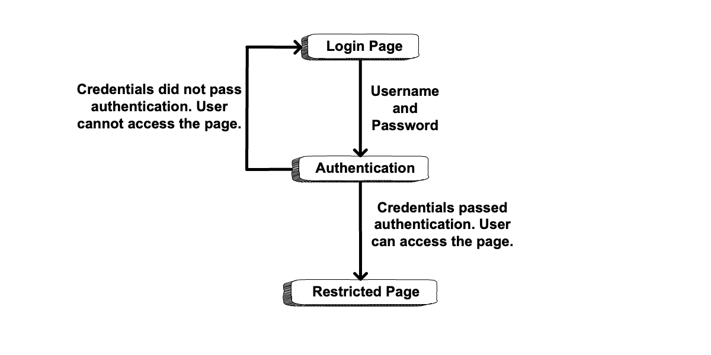
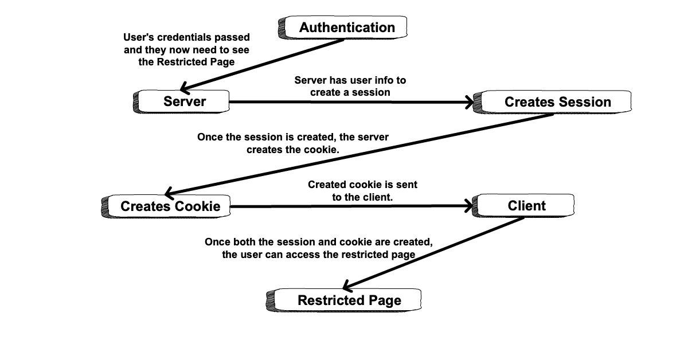
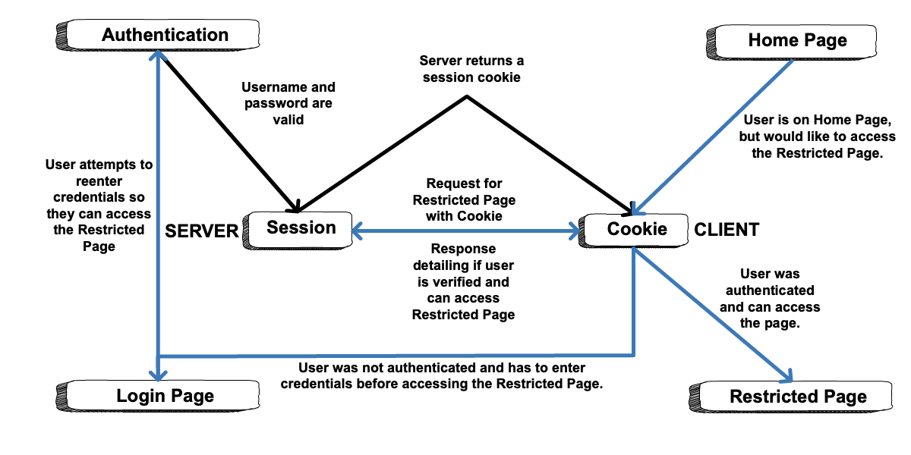

Introduction to Authentication
==============================

We log into many, many websites every day. The process has become so routine that we expect it to work flawlessly every time. How surprised would you be if you logged into a website and saw a different user's account info? What if you entered the wrong password and were still let in? What we have come to expect as routine is anything but when we consider the code needed to make it happen. 

What Is Authentication?
-----------------------

.. index:: ! authentication

**Authentication** is the process of determining a user's *identity*. In other words, are they who they say they are? 

This is typically done by asking a user to provide a *secret* piece of data, which theoretically only they should know. Passwords are the most commonly used secrets, but there are others such as RSA keys and physical authentication tokens. Authentication relies on the ability of the user to keep their secret data, well, *secret*. If we are given as user's secret data, we assume that only one person could have provided it.

.. index:: ! authorization

A related, but different, concept is **authorization**. Authorization is the process of determining if a user is allowed to carry out a specific action.

.. admonition:: Example

   I can share a Google doc with my coworker with read-only permission. They are then *authorized* to view the document, but not to make changes.

Most applications that store personal data use authentication and authorization together. In this book, however, we will only discuss authentication.

Flow for Simple Authentication
------------------------------

Using authentication allows a web application to restrict access to certain pages to known users only. The simplest form of authentication treats all users the same. If a user is signed in, then they are allowed to view *all* restricted pages. Otherwise, they may not view any. With simple authentication, it is not possible to restrict a page to some users while allowing access by others.

Simple authentication requires that for *every* request, the application answers two questions before the request is handled by a controller:

- Is the user asking for a restricted page? 
- If so, do we know who they are? 

The answers to these questions determine whether or not the user is allowed to view the page.

The logical flow of simple authentication looks like this:

   General authentication flow

Sessions and Cookies
^^^^^^^^^^^^^^^^^^^^
.. index:: ! session, ! cookie

The second question above---"Do we know who they are?"---sounds simple enough. However, to determine *which* user is making *which* request turns out to be more complicated. To do this, simple authentication relies on two standard web tools, **sessions** and **cookies**.

A **session** is a collection of temporary data stored *on the server* that corresponds to a specific user. Sessions are often used to store data that an app wants to keep track of in the short term, but not permanently.

.. admonition:: Examples

   Some types of data that might be stored in a session:

   - Items in a shopping cart
   - Whether or not a user is logged in
   - Data from a multi-page form, such as a checkout process

A **cookie** is a piece of temporary data stored *in the user's browser*. Cookies are also used to keep short-term data. While a session can hold lots of data entries, a cookie contains only a single key/value pair. However, a browser may hold a large number of cookies.

.. admonition:: Note

   A detailed discussion of cookies is beyond the scope of this book. For more info, read `"HTTP Cookies" on MDN <https://developer.mozilla.org/en-US/docs/Web/HTTP/Cookies>`_.

Cookies and sessions work together to enable simple authentication in the following way:

.. index:: 
   single: cookie; session
   single: session; ID

#. When a user is authenticated---that is, they provide a valid username/password pair---a session containing their user ID is created on the server. The session has a unique **session ID**, such as ``81LfWG9``.
#. In order to associate the user with their session, the server creates a **session cookie** and returns the cookie to the browser within an HTTP response. The session cookie contains the session ID, and looks something like this: ``session_id: 81LfWG9``. 
#. For each subsequent request to the server, the browser passes the session cookie along with the request.
#. When the server receives a request for a restricted resource, it checks for a session cookie. It then looks for a session with the given session ID. If such a session exists, then the server knows who the user is since their user ID is stored in the session. If the session does NOT exist, then the server does not know the user and they must authenticate themselves.

The following diagram shows the initial creation (steps 1-2) of the session and cookie after a user signs in.

   A flow diagram showing the session and subsequent cookie being created so the user can access a restricted page.

As the user navigates the site, sessions and cookies are used to validate whether users can access restricted pages.
The next diagram shows the flow of steps 1-2 in black and the flow of steps 3-4 in blue.

   A flow diagram showing how sessions and cookies are used to validate an initial request to the server and any subsequent requests to the server.

.. admonition:: Note

   At some point, you may have cleared all of the cookies from your browser only to find that you were suddenly logged out of every website on the Internet. This is because those cookies stored the session IDs that allowed the various sites to know who you were. 

A logout request to a web app simply destroys the user's session, erasing any memory of who they are. Even if they pass a session cookie in their subsequent requests, the old session and session ID will no longer exist. 

A Note On Authentication In Spring
----------------------------------

Before we proceed, we want to point out something important about authentication in Spring. Spring contains a sub-project, `Spring Security <https://spring.io/projects/spring-security>`_, that provides extensive support for authentication *and* authorization. In addition to supporting simple authentication, Spring Security also supports more sophisticated authorization flows/processes like `OAuth 2 <https://oauth.net/2/>`_. Professional developers working with Spring nearly always use Spring Security.

In this book, we are explicitly not introducing Spring Security for two reasons:

#. The project handles many aspects of the authentication process for you. This hides many of the steps that are important to understand as you learn about authentication.
#. Setting up Spring Security is fairly complicated, and requires concepts that are beyond the scope of this course.

That said, the authentication approach outlined in this chapter is sufficient for use in your personal projects. When you begin working with a team on professional applications, a senior developer will likely be on hand to help with authentication setup.

.. admonition:: Note

   If you are curious about simple authentication using Spring Security, check out `an example <https://github.com/chrisbay/event-log/>`_ on GitHub. Start with the `SecurityConfig class <https://github.com/chrisbay/event-log/blob/master/src/main/java/net/chrisbay/eventlog/SecurityConfig.java>`_.

Check Your Understanding
------------------------

.. admonition:: Question

   Which of the following are true:

   #. A session is stored on the server.
   #. A session is stored in the browser.
   #. A cookie is stored on the server.
   #. A cookie is stored in the browser.

.. ans: a and d,  A session is stored on the server. and A cookie is stored in the browser.

.. admonition:: Question

   What is the difference between authentication and authorization?

   #. Authentication handles user permissions, authorization handles user restrictions.
   #. Authentication handles user identity, authorization handles user permissions.
   #. There is no difference, they are synonymous terms.
   #. User authorization can be changed in a request, authentication cannot.

.. ans: b, Authentication handles user identity, authorization handles user permissions.
