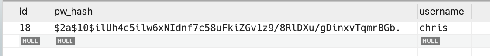
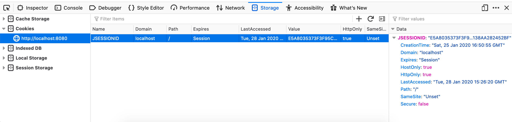

Login and Registration Forms
============================

With a ``User`` class in place, we can now create controllers and views for creating a user and verifying their credentials.

Creating ``AuthenticationController``
-------------------------------------

In the ``controllers`` package, create a new class named ``AuthenticationController``. Since this controller will deal with ``User`` objects, it needs a ``UserRepository`` instance.

.. sourcecode:: java
   :lineno-start: 21

   @Controller
   public class AuthenticationController {

      @Autowired
      UserRepository userRepository;

   }

Session-Handling Utilities
--------------------------

Before creating handler methods for rendering and processing our login and registration forms, we need some utility methods for working with sessions. Below the definition of ``userRepository``, let's add the following class members:

.. sourcecode:: java
   :lineno-start: 27

   private static final String userSessionKey = "user";

   public User getUserFromSession(HttpSession session) {
      Integer userId = (Integer) session.getAttribute(userSessionKey);
      if (userId == null) {
         return null;
      }

      Optional<User> user = userRepository.findById(userId);

      if (user.isEmpty()) {
         return null;
      }

      return user.get();
   }

   private static void setUserInSession(HttpSession session, User user) {
      session.setAttribute(userSessionKey, user.getId());
   }

This code allows us to store and retrieve the login status of a user in a session. More specifically, a logged-in user's user ID will be stored in their session.

.. list-table:: Sample session data for a logged-in user
   :stub-columns: 1

   * - session_id
     - 81LfWG9
   * - user
     - 42

The static field ``userSessionKey`` is the key used to store user IDs. ``setUserInSession`` uses an ``HttpSession`` object (part of the standard ``javax.servlet.http`` package) to store key/value pair. ``getUserFromSession`` looks for data with the key ``user`` in the user's session. If it finds one, it attempts to retrieve the corresponding ``User`` object from the database. If no user ID is in the session, or if there is no user with the given ID, ``null`` is returned.

.. admonition:: Note

   The ``HttpSession`` class handles the details of session creation and lookup for us, including generating unique session IDs and session cookies.

These utility methods will allow our handlers to manage authentication.

Form DTOs
---------

Our login and registration forms will use DTOs to help with form rendering and processing. Furthermore, since these forms will be similar---both require a username and password---we'll use inheritance in creating our DTOs.

The DTO for the login form needs only ``username`` and ``password`` fields.

.. sourcecode:: java
   :lineno-start: 10

   public class LoginFormDTO {

      @NotNull
      @NotBlank
      @Size(min = 3, max = 20, message = "Invalid username. Must be between 3 and 30 characters.")
      private String username;

      @NotNull
      @NotBlank
      @Size(min = 5, max = 20, message = "Invalid password. Must be between 5 and 30 characters.")
      private String password;

      public String getUsername() {
         return username;
      }

      public void setUsername(String username) {
         this.username = username;
      }

      public String getPassword() {
         return password;
      }

      public void setPassword(String password) {
         this.password = password;
      }

   }

``LoginFormDTO`` should live in the ``models.dto`` package.

.. admonition:: Tip

   To better understand this approach, think of a DTO associated with a form as an object that represents each of the form fields. Using a DTO to represent the data associated with a form makes form rendering and processing much easier when the form does not line up with a specific model class.

.. admonition:: Note

   In the class above, we have a password field that will store a plain-text password. However, this does not contradict our early imperative about NOT storing passwords, since ``LoginFormDTO`` is not a persistent class.

Our registration form will ask for a username/password pair, and then ask the user to confirm the password by typing it in again. So the associated DTO can extend ``LoginFormDTO`` and add an additional field for password verification.

.. sourcecode:: java
   :lineno-start: 6

   public class RegisterFormDTO extends LoginFormDTO {

      private String verifyPassword;

      public String getVerifyPassword() {
         return verifyPassword;
      }

      public void setVerifyPassword(String verifyPassword) {
         this.verifyPassword = verifyPassword;
      }

   }

``RegisterFormDTO`` should also live in the ``models.dto`` package.

The Registration Form
---------------------

We are now ready to build our form handlers. Before we can authenticate a user, we must have users in the application, so we'll build the registration form first.

To render the form within ``AuthenticationController`` is simple:

.. sourcecode:: java
   :lineno-start: 48

   @GetMapping("/register")
   public String displayRegistrationForm(Model model) {
      model.addAttribute(new RegisterFormDTO());
      model.addAttribute("title", "Register");
      return "register";
   }

.. admonition:: Note

   When passing an object into the view with ``model.addAttribute``, specifying a label for the object is optional. If a label is not specified the class name is used, with the first letter converted to lowercase.

   In the method above, ``model.addAttribute(new RegisterFormDTO())`` will pass a ``RegisterFormDTO`` object in with the label ``registerFormDTO``.

The registration form (in ``templates/register.html``) uses the three DTO fields to render the form fields:

.. sourcecode:: html
   :linenos:

   <!DOCTYPE html>
   <html lang="en" xmlns:th="http://www.thymeleaf.org/">
   <head th:replace="fragments :: head"></head>
   <body class="container">

   <header th:replace="fragments :: header"></header>

   <form method="post">
      

         <label>Username
               <input class="form-control" th:field="${registerFormDTO.username}" />
         </label>
         

      

      

         <label>Password
               <input class="form-control" th:field="${registerFormDTO.password}" type="password" />
         </label>
         

      

      

         <label>Verify Password
               <input class="form-control" th:field="${registerFormDTO.verifyPassword}" type="password" />
         </label>
      

      <input type="submit" class="btn btn-primary" value="Register" />
   </form>

   </body>
   </html>

The form processing handler is more complicated. Let's look at it, and then break it down in detail.

.. sourcecode:: java
   :lineno-start: 55

   @PostMapping("/register")
   public String processRegistrationForm(@ModelAttribute @Valid RegisterFormDTO registerFormDTO,
                        Errors errors, HttpServletRequest request,
                        Model model) {

      if (errors.hasErrors()) {
         model.addAttribute("title", "Register");
         return "register";
      }

      User existingUser = userRepository.findByUsername(registerFormDTO.getUsername());

      if (existingUser != null) {
         errors.rejectValue("username", "username.alreadyexists", "A user with that username already exists");
         model.addAttribute("title", "Register");
         return "register";
      }

      String password = registerFormDTO.getPassword();
      String verifyPassword = registerFormDTO.getVerifyPassword();
      if (!password.equals(verifyPassword)) {
         errors.rejectValue("password", "passwords.mismatch", "Passwords do not match");
         model.addAttribute("title", "Register");
         return "register";
      }

      User newUser = new User(registerFormDTO.getUsername(), registerFormDTO.getPassword());
      userRepository.save(newUser);
      setUserInSession(request.getSession(), newUser);

      return "redirect:";
   }

- **Lines 55-58**: Define the handler method at the route ``/register`` that takes a valid ``RegisterFormDTO`` object, associated errors, and a ``Model``. In addition, the method needs an ``HttpServletRequest`` object. This object represents the incoming request, and will be provided by Spring.
- **Lines 60-64**: Return the user to the form if an validation errors occur.
- **Line 66**: Retrieve the user with the given username from the database.
- **Lines 68-72**: If a user with the given username already exists, register a custom error with the ``errors`` object and return the user to the form. See the note on using ``errors.rejectValue`` below.
- **Lines 74-80**: Compare the two passwords submitted. If they do not match, register a custom error and return the user to the form.
- **Lines 82-84**: At this point, we know that a user with the given username does NOT already exist, and the rest of the form data is valid. So we create a new user object, store it in the database, and then create a new session for the user.
- **Line 86**: Finally, redirect the user to the home page.

.. admonition:: Note

   The ``Errors`` class we have been using in conjunction with model binding will always contain information about errors related to validation annotations on the given model. However, it can also be used to manually generate additional errors. In the method above, we call:

   .. sourcecode:: java

      errors.rejectValue("username", "username.alreadyexists",
                         "A user with that username already exists");

   ``errors.rejectValue`` takes three parameters:

   #. The field containing the error.
   #. A label representing the error. This allows error messages to be imported from another file. While we don't have such a file, this parameter is required.
   #. A default message to use if no external error message file is available (as is the case here).

This is a good time to test your application. Start it up, navigate to ``/register`` and try to create a user. If everything goes well, you will see a new row in the ``user`` table of the database.

   A new row in the ``user`` table

The Login Form
---------------

Rendering the login form is similar to rendering the registration form:

.. sourcecode:: java
   :lineno-start: 89

   @GetMapping("/login")
   public String displayLoginForm(Model model) {
      model.addAttribute(new LoginFormDTO());
      model.addAttribute("title", "Log In");
      return "login";
   }

The form template itself should be placed in ``templates/login.html``, and is
also similar to the registration template:

.. sourcecode:: html

   <!DOCTYPE html>
   <html lang="en" xmlns:th="http://www.thymeleaf.org/">
   <head th:replace="fragments :: head"></head>
   <body class="container">

   <header th:replace="fragments :: header"></header>

   <form method="post">
      

         <label th:for="username">Username
               <input class="form-control" th:field="${loginFormDTO.username}">
         </label>
         

      

      

         <label>Password
               <input class="form-control" th:field="${loginFormDTO.password}" type="password">
         </label>
         

      

      <input type="submit" class="btn btn-primary" value="Log In" />
   </form>

   
Don't have an account? <a href="/register">Register for one.</a>

   </body>
   </html>

As usual, processing the form is more complicated. Again, we'll break it down in detail.

.. sourcecode:: java
   :lineno-start: 96

   @PostMapping("/login")
   public String processLoginForm(@ModelAttribute @Valid LoginFormDTO loginFormDTO,
                     Errors errors, HttpServletRequest request,
                     Model model) {

      if (errors.hasErrors()) {
         model.addAttribute("title", "Log In");
         return "login";
      }

      User theUser = userRepository.findByUsername(loginFormDTO.getUsername());

        if (theUser == null) {
            errors.rejectValue("username", "user.invalid", "The given username does not exist");
            model.addAttribute("title", "Log In");
            return "login";
        }

        String password = loginFormDTO.getPassword();

        if (!theUser.isMatchingPassword(password)) {
         errors.rejectValue("password", "password.invalid", "Invalid password");
         model.addAttribute("title", "Log In");
         return "login";
      }

      setUserInSession(request.getSession(), theUser);

      return "redirect:";
   }

- **Lines 96-104**: The method definition, parameters, and initial error checking are nearly identical to the registration ``POST`` handler above.
- **Line 106**: Retrieves the ``User`` object with the given password from the database.
- **Lines 108-112**: If no such user exists, register a custom error and return to the form.
- **Line 114**: Retrieves the *submitted* password from the form DTO.
- **Lines 116-120**: If the password is incorrect, register a custom error and return to the form. Password verification uses the ``User.isMatchingPassword()`` method, which handles the details associated with checking hashed passwords.
- **Line 122**: At this point, we know the given user exists and that the submitted password is correct. So we create a new session for the user.
- **Line 124**: Finally, redirect the user to the home page.

Now you can test your login form. Upon successful form submission, you should be redirected to the home page. To verify that a session was created, open Firefox's developer tools and navigate to the *Storage* pane. Select *Cookies > http://localhost:8080* in the left-hand pane and you should see a cookie with the key ``JSESSIONID``. This is the session cookie created by the application. (You may see other cookies as well, which is okay.)

   A session cookie for our application

Logging Out
-----------

After the complicated processes of user registration and login, logging a user
out is refreshingly simple.

.. sourcecode:: java
   :lineno-start: 127

   @GetMapping("/logout")
   public String logout(HttpServletRequest request){
      request.getSession().invalidate();
      return "redirect:/login";
   }

To log out, we simply invalidate the session associated with the given user.
This removes all data from the session, so that when the user makes a
subsequent request, they will be forced to log in again.

The code for this section is available in the `login-reg-forms branch <https://github.com/LaunchCodeEducation/coding-events/tree/login-reg-forms>`_ of the ``coding-events`` repository.

Check Your Understanding
------------------------

.. admonition:: Question

   What is the name of the new method we have introduced on the ``Errors`` object?

   #. ``Errors.hasErrors()``
   #. ``Errors.errors()``
   #. ``Errors.isNotEmpty()``
   #. ``Errors.rejectValue()``

.. ans: d, ``Errors.rejectValue()``

.. admonition:: Question

   Which developer tool panel can we use to verify that a user session has been started?

   #. Console
   #. Network
   #. Storage
   #. Performance

.. ans: c, Storage
