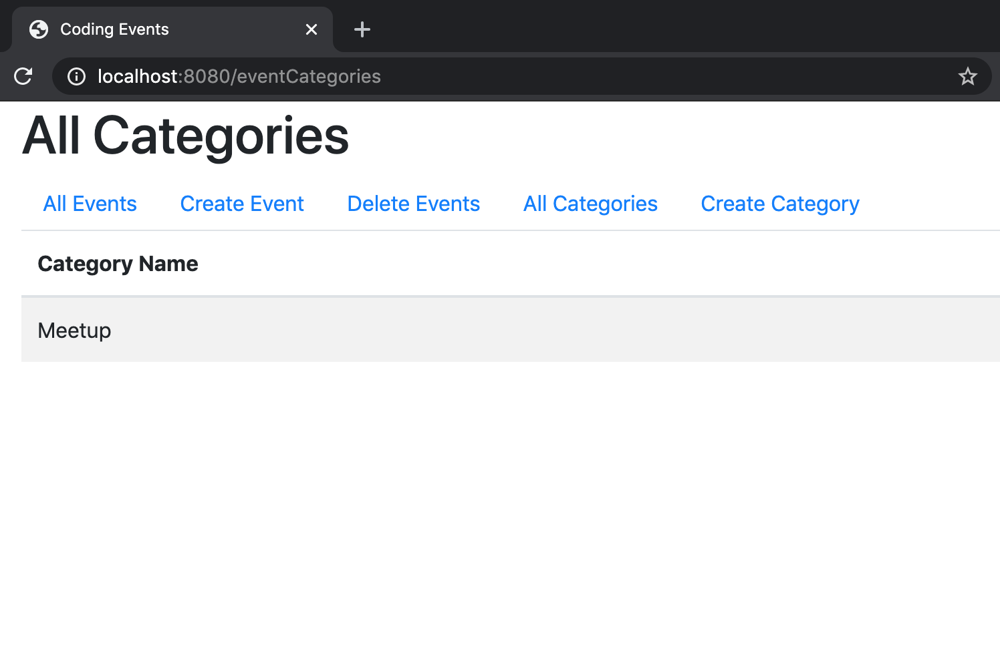
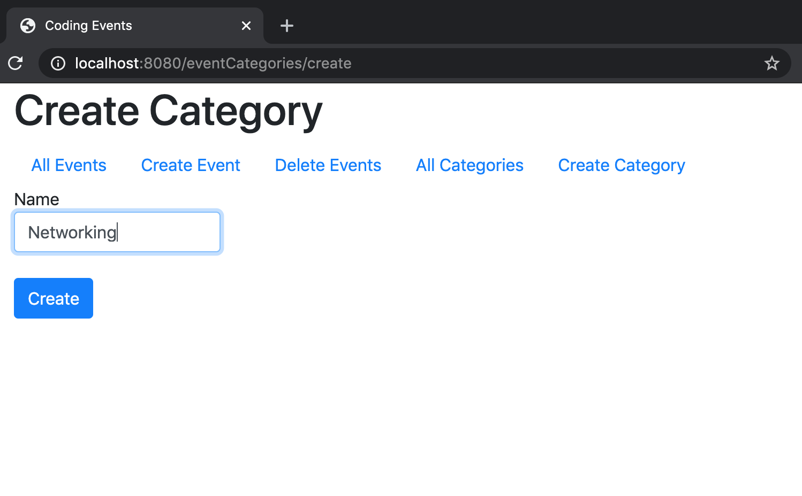
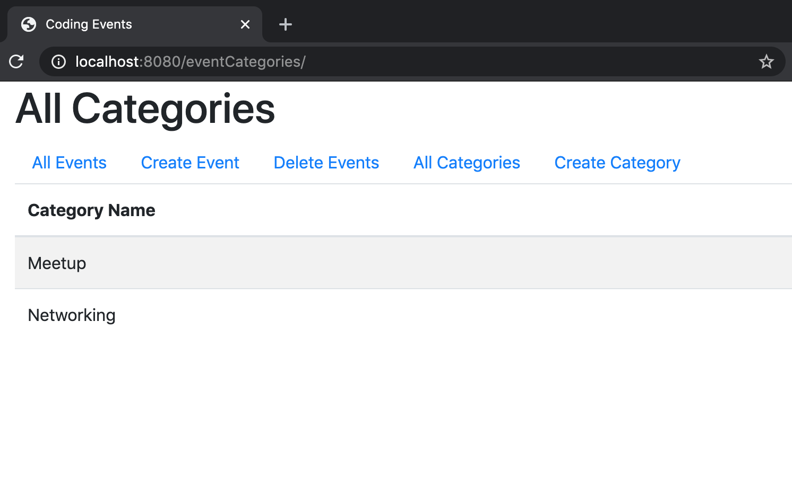

.. _orm1-exercises:

Exercises: OMG the ORM!
=======================

For the exercises, we are going to continue building on our ``coding-events`` application.
The exercise instructions assume that your code resembles the `persistent-controller <https://github.com/LaunchCodeEducation/coding-events/tree/persistent-controller>`_ branch.
Create a new branch off of your ``persistent-controller`` code to get started on the exercises. 

.. admonition:: Note

   You will be making one entity class, one repository, and one controller. If you are not sure what these classes and interface should look like, refer back to the sections on `persistent models <https://www.youtube.com/watch?v=YAISqYMOIAw>`_ and `controllers and repositories <https://www.youtube.com/watch?v=0eug2HI7rbo&t=128s>`_.

The ``EventCategory`` Class
---------------------------

First, create a new class called ``EventCategory`` in the ``models`` directory.

``EventCategory`` needs to have the following:

#. An ``id`` field of type ``int``.
#. A ``name`` field of type ``String``.
#. A constructor.
#. The appropriate getters and setters.

``EventCategory`` represents data that will be stored in our database, so you need to use the ``@Entity`` annotation!

The ``EventCategoryRepository`` Interface
-----------------------------------------

Once you have created ``EventCategory``, you need to create the ``EventCategoryRepository`` in the ``data`` folder.
``EventCategoryRepository`` will extend ``EventCategory``.

The ``EventCategoryController`` Class
-------------------------------------

Create ``EventCategoryController`` in the ``controllers`` directory.
You can use the ``@RequestMapping`` annotation to map to ``"eventCategories"``.
To get our handlers working, we also need a variable of type ``EventCategoryRepository``.

We will be creating 3 handlers in our controller:

#. ``displayAllEvents``
#. ``renderCreateEventCategoryForm``
#. ``processCreateEventCategoryForm``

``displayAllEvents``
^^^^^^^^^^^^^^^^^^^^

``displayAllEvents`` needs to do the following:

#. Use ``@GetMapping`` and return ``"eventCategories/index"``.
#. Add an attribute for the ``title`` that uses ``"All Categories"``.
#. Add an attribute for the ``categories`` that uses all of the values in your ``EventCategoryRepository`` variable.

``renderCreateEventCategoryForm``
^^^^^^^^^^^^^^^^^^^^^^^^^^^^^^^^^

``renderCreateEventCategoryForm`` needs to do the following:

#. Use ``@GetMapping`` and return ``"eventCategories/create"``.
#. Add an attribute for the ``title`` and assign it ``"Create Category"``.
#. Add an attribute for a new instance of ``EventCategory``.

``processCreateEventCategoryForm``
^^^^^^^^^^^^^^^^^^^^^^^^^^^^^^^^^^

``processCreateEventCategoryForm`` needs to do the following:

#. Use ``@PostMapping``.
#. Use error validation and the ``Errors`` object appropriately. If you want to review how to use the ``Errors`` object, check out the section on :ref:`error validation <validating-models>`.
#. Add an attribute for the ``title`` and assign it ``"Create Category"``.
#. Add an attribute for a new instance of ``EventCategory``.
#. Either return ``"eventCategories/create"`` or ``"redirect:"``.

Thymeleaf Templates
-------------------

To finish the exercises, we need to make two new templates.

#. ``eventCategories/index``, which will contain a table of the event categories.
#. ``eventCategories/create``, which will contain a form for adding new event categories.

The Final Application
---------------------

Once you are done, launch your app and head to ``localhost:8080/eventCategories``!
If you added categories already, you will see any categories already stored in the database.
In this case, we added "Meetup" as a category the first time we ran our app to test it.

If you click on "Create Category", you should be directed to ``localhost:8080/eventCategories/create``.
We decided to add "Networking" as a category and filled out the form.

Once you hit submit, you are redirected back to ``localhost:8080/eventCategories``, and your table now contains the newest event category!

