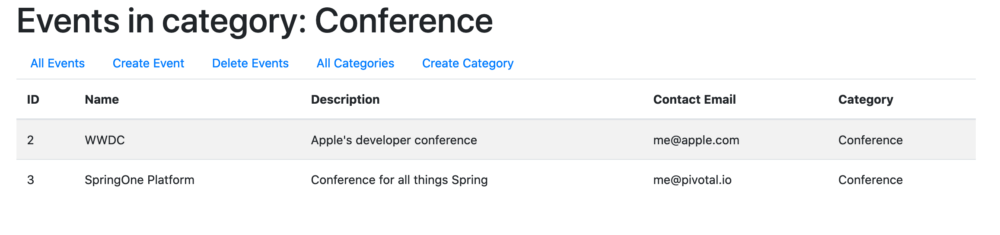

Creating a One-to-Many Relationship
===================================

The previous section established a persistent many-to-one relationship between ``Event`` objects and ``EventCategory`` objects. This section demonstrates how to create the inverse one-to-many relationship.

Setting Up the Relationship - Video
-----------------------------------

.. youtube::
   :video_id: RLykFBY9Rys
   :gh_path: LaunchCodeEducation/coding-events/one-to-many

Setting Up the Relationship - Text
----------------------------------

Creating a one-to-many relationship from categories to events means that each ``EventCategory`` object will have access to each event that belongs to it. Near the top of ``EventCategory``, add a new field to store these events.

Model Configuration
^^^^^^^^^^^^^^^^^^^

.. sourcecode:: java
   :lineno-start: 19

   private final List<Event> events = new ArrayList<>();

The ``events`` field will be initialized when an ``EventCategory`` object is created. It is marked ``final`` to ensure that the collection isn't deleted or replaced. Since it is final, only a getter is needed; add one near the bottom of the class.

.. admonition:: Note

   Recall that when a collection is marked ``final`` its *contents* are allowed to change, but the collection object itself may not be changed. In other words, we may add or remove items from the ``events`` list, but we may not reassign the value of ``events``.

To establish a persistent relationship, we use the ``@OneToMany`` annotation on ``events``. This annotation requires a parameter to let Hibernate know *how* to determine which events belong to a given category object.

.. sourcecode:: java
   :lineno-start: 18

   @OneToMany(mappedBy = "eventCategory")
   private final List<Event> events = new ArrayList<>();

By specifying ``mappedBy = "eventCategory"``, we are telling Hibernate that for a given category object, ``someCategory``, the ``events`` collection should be populated by all events for which the ``eventCategory`` field is set to ``someCategory``. To determine this, Hibernate will look at the foreign key column on the ``events`` table.

Controller Updates
^^^^^^^^^^^^^^^^^^

In order to use this newly established relationship, we need a controller and view that access the events for a given category. We will create a new view that lists *events by category*. In other words, given a category ID, the view will display a list of all events in the given category.

The end result will look like this:

   Events belonging to a specific category

Notice that this view is extremely similar to our main view listing all events. The only differences are the title and the specific events in the list. Since both ``title`` and ``events`` are values that we pass into our ``events/index.html`` template, we can use the same template for this view as we have been using for the view at route ``/events``. 

Taking this one step further, we will use the same controller as well. This will allow us to have a route, ``/events`` that displays *all* events if no ``eventId`` is specified, but displays a filtered list when a valid ``eventId`` is provided. Let's get to work in ``EventController``.

The method at the route ``/events`` is ``displayAllEvents``. Since this handler will no longer *always* display all events, we rename it to ``displayEvents``.

.. admonition:: Note

   We have renamed this method in the repository linked above, but the video skips this step.

Let's view the finished handler method and break down the changes one-by-one:

.. sourcecode:: java
   :lineno-start: 29

   @GetMapping
   public String displayEvents(@RequestParam(required = false) Integer categoryId, Model model) {

      if (categoryId == null) {
         model.addAttribute("title", "All Events");
         model.addAttribute("events", eventRepository.findAll());
      } else {
         Optional<EventCategory> result = eventCategoryRepository.findById(categoryId);
         if (result.isEmpty()) {
               model.addAttribute("title", "Invalid Category ID: " + categoryId);
         } else {
               EventCategory category = result.get();
               model.addAttribute("title", "Events in category: " + category.getName());
               model.addAttribute("events", category.getEvents());
         }
      }

      return "events/index";
   }

Update 1: Optional ``categoryId`` Parameter
+++++++++++++++++++++++++++++++++++++++++++

In order to filter events by category, we need the ID of a category to filter by. The handler now has a new parameter:

.. sourcecode:: java

   @RequestParam(required = false) Integer categoryId

This allows requests to URLs like ``/events?categoryId=1``. By specifying ``required = false`` we are telling Spring that it should call this handler for requests to the path ``/events`` even if no such ID is specified. This allows us to preserve our existing behavior that lists *all* events at ``/events``. If no ``categoryId`` is specified in the request, then the ``categoryId`` parameter will be ``null`` when the handler is called.

Update 2: ``null`` Check
++++++++++++++++++++++++

Much of the method consists of a large ``if``/``else if``/``else`` block.

Before filtering by category, we check for the existence of the ``categoryId`` parameter. The first part of the conditional block is:

.. sourcecode:: java
   :lineno-start: 32

   if (categoryId == null) {
      model.addAttribute("title", "All Events");
      model.addAttribute("events", eventRepository.findAll());
   }

If no ``categoryId`` is passed in, we carry out the same behavior as before, passing all events into the view.

Update 3: Ensuring the Category Object Exists
+++++++++++++++++++++++++++++++++++++++++++++

If the conditional check above fails, then we have a non-null ``categoryId``. However, this does not guarantee that an object with the given ID exists in the database. We must manually check for the existence of such an object.

Here's our conditional block with the next piece added:

.. sourcecode:: java
   :lineno-start: 32

   if (categoryId == null) {
      model.addAttribute("title", "All Events");
      model.addAttribute("events", eventRepository.findAll());
   } else {
      Optional<EventCategory> result = eventCategoryRepository.findById(categoryId);
      if (result.isEmpty()) {
            model.addAttribute("title", "Invalid Category ID: " + categoryId);
      } else {
            // TODO 
      }
   }

Line 36 queries our repository for a category object with the given ID. Notice that the ``findById`` method returns not an ``EventCategory`` object, but something of type ``Optional<EventCategory>``. Huh? 

Referring to the `documentation for the CrudRepository.findById <https://docs.spring.io/spring-data/commons/docs/current/api/org/springframework/data/repository/CrudRepository.html#findById-ID->`_  method, we see that it returns an ``Optional`` instance. We don't currently know what the heck that is, but referring to the `documentation for Optional <https://docs.oracle.com/javase/8/docs/api/java/util/Optional.html?is-external=true>`_ describes how to use this class.

Essentially, by returning an ``Optional<EventCategory>`` object, the ``findById`` method is taking into account the exact situation we are in, that an object with such an ID may not exist. An ``Optional`` object can be thought of as a container for the results of our query. If such an object *does* exist, we can get it using ``Optional.get()``. Otherwise, ``Optional.isEmpty()`` will return true.

On lines 37-38 we use this fact to check to see if an ``EventCategory`` object was found. If not, we display an error message in the title.

.. admonition:: Tip

   As you wade into vast waters of Java and Spring, you will frequently find yourself needing to use a method or class that you have not encountered before. In such cases, be brave and remember that you don't have to understand *all* of the documentation for a method or class in order to use it. 

Update 4: Retrieving Events For the Given Category
++++++++++++++++++++++++++++++++++++++++++++++++++

We are finally ready to consider the full conditional:

.. sourcecode:: java
   :lineno-start: 32

   if (categoryId == null) {
      model.addAttribute("title", "All Events");
      model.addAttribute("events", eventRepository.findAll());
   } else {
      Optional<EventCategory> result = eventCategoryRepository.findById(categoryId);
      if (result.isEmpty()) {
            model.addAttribute("title", "Invalid Category ID: " + categoryId);
      } else {
            EventCategory category = result.get();
            model.addAttribute("title", "Events in category: " + category.getName());
            model.addAttribute("events", category.getEvents());
      }
   }

Lines 39-42 will only execute if we know for sure that a category with the given ID exists. In this case, we extract the category from the ``Optional`` object ``result`` using the ``get()`` method. Then we create an appropriate title using the category name, and pass the events belonging to the category into the view.

Line 42 is what we have been building up to this entire time. Our ``category`` object now has an ``events`` field that is populated using the ``@OneToMany`` annotation that we added near the beginning of this section, allowing the inverse relationship to be established.

Now, not only do events have categories, but categories know which events they contain.

Linking to Filtered Views
^^^^^^^^^^^^^^^^^^^^^^^^^

With our new controller logic in place, we have one small update to make before we can fully use this new functionality.

We need to provide a way for the user to access our new filtered views. In the ``eventCategories/index.html`` template, modify the loop within the table to include a link to the filtered view for each category:

.. sourcecode:: html
   :lineno-start: 14

   <tr th:each="category : ${categories}">
      <td></td>
   </tr>

The logic in ``th:href`` uses string concatenation to create the appropriate URL for each category.

With this code in place, start up our application and test out the new functionality! Be sure to navigate to ``/eventCategories`` to see your new links to the filtered views. Also, be sure to test that ``/events`` still displays all events. 

Check Your Understanding
------------------------

.. admonition:: Question

   Which of the following is NOT a ``CrudRepository`` method? Check all that apply.

   #. ``.findAll()``
   #. ``.findById()``
   #. ``.value()``
   #. ``.get()``

.. ans: c + d, .value and .get

.. admonition:: Question

   True/False: The nested conditional in ``displayEvents`` in the ``coding-events`` repo helps curtail an exception making its way to the user.

   #. True
   #. False

.. ans: a. True, if the result of ``.findById()`` is not checked, then the application would display an exception when an invalid id passed
