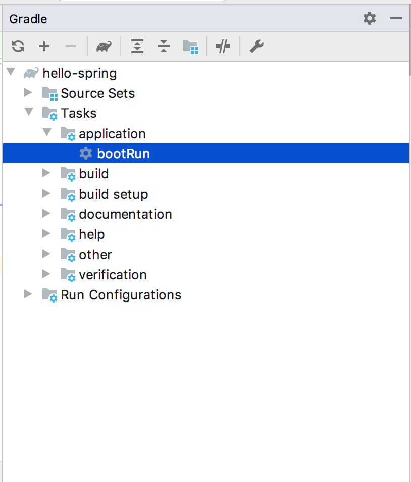

Initialize Spring
=================

Spring Boot is a framework used to build Java web applications that
implement the
:ref:`MVC <mvc>` pattern. For more about Spring, check out `Spring
IO <https://spring.io/>`__.

.. _initialize-spring-boot-project:

Initialize a Spring Boot Project - Video
----------------------------------------

.. youtube::
   :video_id: Z_exRQyLwOY

Initialize a Spring Boot Project - Text
---------------------------------------

#. Go to `start.spring.io <https://start.spring.io/>`__.
#. For *Project*, select *Gradle Project*.
#. For *Language*, select *Java*.
#. For *Spring Boot*, select *2.2.x* (that is, the most
   recent 2.2 non-SNAPSHOT release).
#. For *Project Metadata/Group*, enter ``org.launchcode``.

   .. note::

      You can use whatever package name you want here. The convention is
      ``topleveldomain.domainname``. In other words, the reverse of what
      you would see in a URL.

#. For *Project Metadata/Artifact*, enter ``hello-spring``.

   .. note::

      This is the title of your project.

#. For *Project Metadata/Options/Java*, select *13*.
#. For *Dependencies*, search for and add the following: *Spring Web*,
   and *Spring Boot DevTools*.
#. Click *Generate* to create a ``.zip`` file of the project starter code.

.. figure:: figures/spring-initializr.png
   :alt: Spring initializer with options

   Spring Initializer with desired options selected.

Spring in IntelliJ
------------------

#. Move the downloaded unzipped folder from your downloads folder into
   another location such as ``LC101`` or your home directory.
#. Start IntelliJ.
#. Select *Import Project* and browse to where you put the downloaded
   project.
#. Select *Import project from external model* and pick *Gradle*. Select all other defaults
   as you create the project.

   .. note::

      If you encounter an alert that the selected folder is not empty, choose
      the option to overwrite it.

#. If you see a Gradle build popup, go ahead and click
   *Import Gradle Project*.

   .. figure:: figures/import-gradle-tip.png
      :alt: Popup to import Gradle

      A popup to suggest importing Gradle.

   .. note::

      This popup is fairly small and usually located in the lower right corner of the window.

#. If a window then opens, check the *Use auto-import* box and
   leave everything else as it is.

.. admonition:: Note

   You may see a pop-up in the lower left-hand corner in your *Event Log*
   that reads: *Unindexed remote maven repositories found*.

   1. Select *Open repositories list* in the Event Log message. This will
      open the *Preferences* (or *Settings* for Windows users) window to
      *Build, Execution, Deployment > Build Tools > Maven > Repositories* .
   2. Select the Maven repository (https://repo1.maven.org/maven2) and
      click *Update* on the side.

.. warning::

   This update usually takes about 20 minutes but can last up to an hour.

The Spring Project Structure
----------------------------

The Spring Initializr gives us a number of helpful files and
directories to get our Spring project up and running.

Within the ``src`` directory, you’ll find a familiar setup with both a ``main`` and
``test`` directory. Inside of ``main`` will be a ``java`` folder to house your packages and
classes. Inside the ``java`` folder is a ``HelloSpringApplication``. Opening this for the first
time, you'll likely see some import errors that can be resolved by clicking on the context menu
to add the corresponding library to the classpath. Expanding the main method shows you the line
that allows the application to run. We'll run the app in the section below but won't be working with
much else with the main method in this course.

You’ll also find that there is a ``resources`` folder in ``main``. ``resources`` is
meant to hold your non-java code.

Outside of ``src``, a ``.gitignore`` contains the basic items of our project that
Spring expects to not be version controlled. These are files created by the IDE, the compiled
code in the ``.build`` directory, and the gradle ``.jar`` and directory.

.. index:: ! Gradle

Gradle
^^^^^^

Gradle is a Java tool that handles much of the work related to building and deploying software
applications in Java. Your Spring project contains a file called ``build.gradle``. As with most new
tools, you do not need to know everything that this file does. For now, the takeaway is that
Gradle manages the external dependencies in our project.

Remember specifying the dependencies of the Spring project? Scroll down to the bottom of your
``build.gradle`` file and you will see these items specified in a structure called ``dependencies``.

.. sourcecode:: guess
   :lineno-start: 22

   dependencies {
      implementation 'org.springframework.boot:spring-boot-starter-thymeleaf'
      implementation 'org.springframework.boot:spring-boot-starter-web'
      developmentOnly 'org.springframework.boot:spring-boot-devtools'
      testImplementation('org.springframework.boot:spring-boot-starter-test') {
         exclude group: 'org.junit.vintage’, module: ‘junit-vintage-engine'
      }
   }

Gradle fetches these external packages from another location on the Internet so that we can use them
in our project locally. That location is called the Maven central repository. The Maven central repository
is a decentralized place for developers to post their code for others to use.

.. index:: ! bootRun

Before Running a Spring Project
-------------------------------

Before running your project, we need to check the configuration of a few items. 

#. In ``build,gradle``, locate an item called ``sourceCompatibility``. If it's value is not equal to 
``13``, change it and save the file.

#. In the ``gradle`` directory, open the subdirectory, ``wrapper``, and then the file 
``gradle-wrapper.properties`` inside of it. Ensure that the ``distributionUrl`` includes a gradle 
version of at least ``6.0``. 

#. Open the test class, ``HelloSpringApplicationTests`` located in ``src/test/java/org.launchcode.hellospring``.
   Run the single test. If you experience a JDK error, click on the ``Gradle Settings`` icon in the right-hand
   gradle pane and ensure that the Gradle JVM is using Java 13.

.. index:: ! bootRun

Running a Spring Project
------------------------

To run the application, click on the Gradle icon on the side of your IntelliJ window. If you don’t see the Gradle side bar,
click the panel icon in the bottom left corner of your window and select *Gradle*.

.. figure:: figures/panel-icon.png
   :alt: Panel icon options expanded

   Hovering over this icon opens options for panels to open.

Once the Gradle panel is opened, go into *Tasks*. Here you'll find the various tasks that Gradle can do for your
project. Inside *Tasks*, open *application* and double-click *bootRun*. This will run our Spring Boot application.

   Gradle panel view with bootRun selected.

Once the ``bootRun`` task is executed, you should see a new panel with output similar to this:

.. figure:: figures/bootrun-output.png
   :alt: bootRun output

   Output of the ``bootRun`` task.

.. admonition:: Note

   Also note that you may not see the same output in the Gradle panel as is
   shown above. You may see something that looks more like this:

   .. figure:: figures/windows-bootrun.png
      :alt: Alternative bootrun view

      Click the circled icon to switch the view.

   If you do, click the circled icon to toggle the view so that it matches
   the one above.

Keep an eye out for a message that resembles:

.. sourcecode:: bash

   Started HelloSpringApplication in 1.739 seconds

While this message will change depending on the application you are running, this message indicates that the
Spring Boot started up successfully. You'll see an error message or a stack trace if there is an issue with
your project preventing it from starting.

You'll also notice a message above:

.. sourcecode:: bash

   Tomcat started on port(s): 8080 ...

Tomcat is the embedded web server within your Spring application. So this tells us that Tomcat is listening
for requests on local port 8080. You can then visit the corresponding web page at ``localhost:8080``.
Right now, you’ll see an error page, but we’ll fix that soon.
Now go ahead and stop the application by hitting the red square on the left side of the *Run* pane.

.. tip::

   There is also a stop button up at the top right of the IntelliJ window.

Check Your Understanding
------------------------

.. admonition:: Question

   What is the name of the task to start a Spring Boot application?
 
   a. Gradle
      
   b. bootRun

   c. run

   d. Maven

.. ans: b, bootRun

.. admonition:: Question

   True/False: All custom code in a Spring Boot application is located in the ``main`` method.
 
   a. True

   b. False

.. ans: False, most features are developed outside of the ``main`` method in a Spring Boot application.

