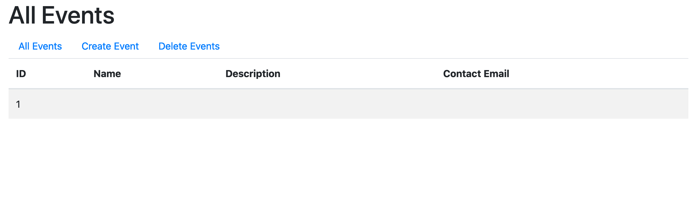

Validation Annotations
======================

Within the model of a Java web application, we can define validation rules using annotations from the ``javax.validation.constraints`` package. This package provides a variety of annotations that are useful in common circumstances, and which can be applied to model fields. 

.. index::
   single: validation, annotations

.. index:: ! @Size, ! @Min, ! @Max, ! @Email, ! @NotBlank, ! @NotNull

Common Annotations
------------------

We'll use only a few of these annotations, but you can find a full list in the `package documentation <https://javaee.github.io/javaee-spec/javadocs/javax/validation/constraints/package-summary.html>`_.

.. list-table:: Common Validation Annotations
   :header-rows: 1

   * - Annotation
     - Description
     - Syntax
   * - ``@Size``
     - Specifies minimum and/or maximum length for a string.
     - ``@Size(min = 3, max = 12)``
   * - ``@Min``
     - Specifies the minimum value of a numeric field.
     - ``@Min(0)``
   * - ``@Max``
     - Specifies the maximum value of a numeric field.
     - ``@Max(365)``
   * - ``@Email``
     - Specifies that a string field should conform to email formatting standards.
     - ``@Email``
   * - ``@NotNull``
     - Specifies that a field may not be ``null``.
     - ``@NotNull``
   * - ``@NotBlank``
     - Specifies that a string field contains at least one non-whitespace character.
     - ``@NotBlank``

.. admonition:: Example

   To apply the validation rules of the :ref:`example on the previous page <validation-example>` to the fields of a ``User`` model class, we can use ``@Size`` and ``@NotBlank``.

   .. sourcecode:: java

      @NotBlank
      @Size(min = 3, max = 12)
      private String username;

      @NotBlank
      @Size(min = 6)
      private String password;

Defining Validation Messages
----------------------------

.. _validation-messages:

.. index::
   single: validation, message

Each of these annotations takes an optional ``message`` parameter that allows you to define a user-friendly description to be used when validation fails.

.. admonition:: Example

   .. sourcecode:: java

      @NotBlank(message = "Username is required")
      @Size(min = 3, max = 12, message = "Username must be between 3 and 12 characters long")
      private String username;

      @NotBlank(message = "Password is required")
      @Size(min = 6, message = "Sorry, but the given password is too short. Passwords must be at least 6 characters long.")
      private String password;

We will see how to ensure these messages are properly displayed in the next section, :ref:`validating-models`.

Applying Validation Annotations - Video
---------------------------------------

.. youtube::
   :video_id: 1aZxU0-dhgw
   :gh_path: LaunchCodeEducation/coding-events/add-validation-annotations

Applying Validation Annotations - Text
--------------------------------------

To configure validation on the model-side, we begin by adding validation annotations to each field to which we want to apply constraints.

For our ``Event`` class, we add ``@Size`` and ``@NotBlank`` to the ``name`` field, and just ``@Size`` to the ``description`` field.

.. sourcecode:: java
   :lineno-start: 16

   @NotBlank(message = "Name is required.")
   @Size(min = 3, max = 50, message = "Name must be between 3 and 50 characters")
   private String name;

   @Size(max = 500, message = "Description too long!")
   private String description;

The ``min`` and ``max`` parameters for ``@Size`` specify the minimum and maximum number of allowed characters, respectively. Omitting either of these means that no min or max will be applied for the field. For our ``description`` field, leaving off ``min`` effectively makes this field optional.

Each of our annotations also receives a ``message`` parameter, which provides a user-friendly message to display to the user if the particular validation rule fails. We will see how to display these in a view a bit later. 

Next, we add a new field to store a contact email for each event. This is a ``String`` named ``contactEmail``. Validating email addresses by directly applying each of the rules that an email must satisfy is *extremely* difficult. Thankfully, there is an ``@Email`` validation annotation that we can apply to our new field.

After adding this new field to our constructor, and generating a getter and setter, our class is done for the moment.

.. sourcecode:: java
   :lineno-start: 11

   public class Event {

      private int id;
      private static int nextId = 1;

      @NotBlank
      @Size(min = 3, max = 50, message = "Name must be between 3 and 50 characters")
      private String name;

      @Size(max = 500, message = "Description too long!")
      private String description;

      @Email(message = "Invalid email. Try again.")
      private String contactEmail;

      public Event(String name, String description, String contactEmail) {
         this.name = name;
         this.description = description;
         this.contactEmail = contactEmail;
         this.id = nextId;
         nextId++;
      }

      public String getName() {
         return name;
      }

      public void setName(String name) {
         this.name = name;
      }

      public String getDescription() {
         return description;
      }

      public void setDescription(String description) {
         this.description = description;
      }

      public String getContactEmail() {
         return contactEmail;
      }

      public void setContactEmail(String contactEmail) {
         this.contactEmail = contactEmail;
      }

      public int getId() {
         return id;
      }

      @Override
      public String toString() {
         return name;
      }

      @Override
      public boolean equals(Object o) {
         if (this == o) return true;
         if (o == null || getClass() != o.getClass()) return false;
         Event event = (Event) o;
         return id == event.id;
      }

      @Override
      public int hashCode() {
         return Objects.hash(id);
      }
   }

.. admonition:: Tip

   The full list of Java validation annotations is in the `documentation <https://javaee.github.io/javaee-spec/javadocs/javax/validation/constraints/package-summary.html>`_ for ``javax.validation.constraints``.

Before we can start up our application, we need to add a new column to the ``events/index`` template to make ``contactEmail`` visible. 

.. sourcecode:: html
   :lineno-start: 8

   <table class="table table-striped">
      <thead>
         <tr>
            <th>ID</th>
            <th>Name</th>
            <th>Description</th>
            <th>Contact Email</th>
         </tr>
      </thead>
      <tr th:each="event : ${events}">
         <td th:text="${event.id}"></td>
         <td th:text="${event.name}"></td>
         <td th:text="${event.description}"></td>
         <td th:text="${event.contactEmail}"></td>
      </tr>
   </table>

Now we can start up our application and test. Submitting an empty form at ``/events/create`` still results in an event being created, which may not be what you were expecting. 

   Even after adding validation annotations, we can still create invalid data.
   
Rather than a bug, this is expected behavior. Recall that validation involves *both* the model and controller, but we have not modified the controller in any way. Validation annotations simply define the validation rules that *should* be used to check data. The responsibility of checking the data before saving a new event lies with the controller.

In the next section, we'll modify the controller to properly check for valid data.

Check Your Understanding
------------------------

.. admonition:: Question

   **True or False:** When using ``@Size`` you must provide both ``min`` and ``max`` arguments.

.. ans: False, one or both arguments may be used.

.. admonition:: Question

   **True or False:** Adding validation annotations to a model ensures that bad data is not saved.

.. ans: False, server-side validation requires cooperation from annotations on the model, as well as controller logic
