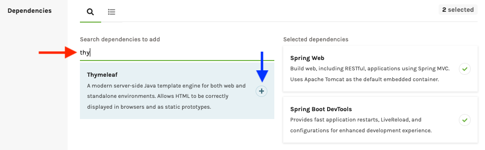
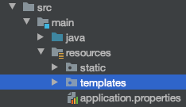

Creating a Template
====================

Using templates is a useful way to reduce the effort required to create and
maintain a web-based project. Before you can dive into using templates,
however, you need to take care of a little groundwork first.

Thymeleaf
----------

.. index:: ! Thymeleaf

In combination with Java and Spring Boot, we will use a library called
**Thymeleaf**. This set of tools helps simplify the creation of flexible,
reusable templates for standalone projects and web-based applications.

More information can be found on the `introduction page <https://www.thymeleaf.org/doc/tutorials/3.0/usingthymeleaf.html#introducing-thymeleaf>`__
of the Thymeleaf website.

Thymeleaf, Naturally
^^^^^^^^^^^^^^^^^^^^^

The developers behind Thymeleaf emphasize the idea of *natural templates*. This
means that templates constructed with Thymeleaf look and operate just like
regular HTML code. You can open any template in a browser and view it just
like a static HTML file.

Any logic we add to a template occurs inside the tags, which preserves the
ability to open the file and display it correctly. This helps us as we
consider the best layout for presenting data on the screen.

Thymeleaf Dependency
---------------------

In this chapter, you will construct some small practice projects to help you
learn how to implement Thymeleaf templates. To use the library, however, you
need to provide IntelliJ with some information to make the IDE recognize
Thymeleaf syntax and commands. You need to include in the proper
*dependencies*, and there are two common ways to accomplish this.

During Setup for a New Project
^^^^^^^^^^^^^^^^^^^^^^^^^^^^^^^

When you create a new Gradle project on the `start.spring.io <https://start.spring.io/>`__
website, search for and select the *Thymeleaf* dependency. For the practice
projects you build in this class, be sure to add the *Spring Web* and
*Spring Boot DevTools* dependencies as well.

In IntelliJ, opening up the ``build.gradle`` file of the new project shows the
dependencies you selected:

.. sourcecode:: groovy
   :lineno-start: 22

   dependencies {
      implementation 'org.springframework.boot:spring-boot-starter-thymeleaf'
      implementation 'org.springframework.boot:spring-boot-starter-web'
      developmentOnly 'org.springframework.boot:spring-boot-devtools'
      testImplementation('org.springframework.boot:spring-boot-starter-test') {
         exclude group: 'org.junit.vintage', module: 'junit-vintage-engine'
      }
   }

Lines 23 - 25 establish links to the ``thymeleaf``,
``spring-boot-starter-web``, and ``spring-boot-devtools`` libraries,
respectively.

Add to an Existing Project
^^^^^^^^^^^^^^^^^^^^^^^^^^^

If you have an existing project that does not currently use Thymeleaf, you
can add the functionality by updating the ``build.gradle`` file.

.. figure:: ./figures/buildGradleFileTree.png
   :alt: build.gradle file in the src directory.

In the ``dependencies`` block, just paste in the ``implementation`` statement
seen in line 23 above. Also, be sure to include the Spring Boot libraries if
the old project is missing those as well.

Start a Practice Project
-------------------------

Open up your ``hello-spring`` project in IntelliJ and code along with the
following video.

.. admonition:: Warning

   The videos in this chapter walk you through building small web-based
   projects. Do NOT skip this practice, because the end of chapter exercises
   pick up where the tutorials end.

.. youtube::
   :video_id: UIetMLyDVjQ

The sections below outline the main ideas presented in the video. However, the
text is NOT a substitute for completing the work described in the clip.

Template Location
^^^^^^^^^^^^^^^^^^

In IntelliJ, create a ``templates`` folder inside the ``resources`` directory.
All of your templates should be put in the ``templates`` folder. As you saw in
the video, Thymeleaf streamlines finding required files by using
``resources/templates`` as the default location.

Add a Template
^^^^^^^^^^^^^^^

To create a new template, right-click on the ``templates`` folder and select
*New --> HTML file*. Give your template a descriptive name, and note that
IntelliJ provides some boilerplate code:

.. sourcecode:: html
   :linenos:

   <!DOCTYPE html>
   <html lang="en">
   <head>
      <meta charset="UTF-8">
      <title>Title</title>
   </head>
   <body>

   </body>
   </html>

To tie in the Thymeleaf information, you need to add a URL inside the ``html``
tag on line 2:

.. sourcecode:: html

   <html lang="en" xmlns:th="https://www.thymeleaf.org/">

The ``xmlns:th`` attribute pulls in information from ``thymeleaf.org`` about
the keywords and methods that we will use with Thymeleaf. This allows IntelliJ
to properly apply syntax highlighting and error reporting.

A side effect of the ``xmlns:th`` attribute is that it implements stricter
requirements for closing HTML tags. In HTML5, we can get away with leaving out
the ``/`` character in standalone tags like ``<input>``. However, with the
xml format in Thymeleaf, we must include the character.

For example, we need to update line 4 in the boilerplate HTML code to close
the ``meta`` tag:

.. sourcecode:: html

   <meta charset="UTF-8" /> <!-- Note the closing '/' character -->

Thymeleaf Template
-------------------

As described in the video, you can save yourself some time by creating your own
boilerplate code for a Thymeleaf template. This will save you from having to
make the edits described above every time you add a new base html file.

#. Right-click on the ``templates`` folder (or any other directory), and select
   *New --> Edit File Templates*.
#. In the window that pops up, click the "+" icon to add a new file.

   .. figure:: ./figures/createNewTemplate.png
      :alt: Icon to click to create a new Thymeleaf template.
      :scale: 80%

#. Name your template, set the extension as ``html``, then edit the starter
   code. This will be the boilerplate HTML that appears anytime you select your
   custom template. For Thymeleaf, the code should at least close the ``meta``
   tag and include the ``xmlns`` attribute.

   .. figure:: ./figures/thymeleafTemplateCode.png
      :alt: Editor pane for setting Thymeleaf template code.

   If you find yourself routinely using other code in your Thymeleaf files, you
   can return to this window and edit the HTML as needed. Don't forget to save
   your changes.
#. To use your custom Thymeleaf template, right-click on the ``templates``
   folder and select *New --> TemplateName*.

   .. figure:: ./figures/selectThymeleafTemplate.png
      :alt: Menu options for selecting a custom Thymeleaf template.
