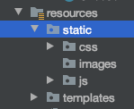

Static Resources
=================

Up to now, we used templates to display controller data as text in the view. If
we need to display an image or video, or if we want to create a link to a
different file, then we need to move beyond a text output.

With Thymeleaf, we can set values for the HTML ``src`` and ``href`` attributes.
Instead of hard-coding a file path or external URL inside a tag, ``th:src`` and
``th:href`` take advantage of a simpler syntax. You did this near the end of
the last video when you referenced information stored in files other than the
controller or the template.

Accessing Resources
--------------------

Inside the ``resources`` folder, there is another directory called ``static``.
By convention, this is the location where we store files that our project needs
to access---like images, CSS stylesheets, JavaScript code, etc.

``th:src`` and ``th:href`` - Video
^^^^^^^^^^^^^^^^^^^^^^^^^^^^^^^^^^

Code along with this final video to practice adding static resources to your
``coding-events`` project:

.. youtube::
   :video_id: syzOmHnTnmo

``th:src``
^^^^^^^^^^

To access a file with the standard HTML ``src`` attribute, we need to provide
either a detailed or relative file path in order to establish a link.
``th:src`` shortens this process by filling in most of the file path
automatically (``.../project-name/src/main/resources/static``). All we
need to do is fill in the last portion of the file path---everything after
``/static``.

The general syntax is:

.. sourcecode:: groovy

   th:src = "@{/filePath}"

.. admonition:: Examples

   If we have an image file called ``familyPhoto1.jpg`` stored in
   ``static``, then we can display it in the view with an ``img`` tag as follows:

   .. sourcecode:: HTML

      

   If the image is contained in an ``images`` folder inside ``static``, then the
   syntax is:

   .. sourcecode:: HTML

      

Think of the ``@`` symbol as representing everything in the file path up to the
``static`` folder.

``th:href``
^^^^^^^^^^^^

The syntax for ``th:href`` is the same as that for ``th:src``. For example, to
link to a CSS stylesheet:

.. sourcecode:: HTML

   <link rel = "stylesheet" th:href="@{/css/styles.css}" />

Check Your Understanding
-------------------------

.. admonition:: Question

   Given the file tree shown below, which option displays the correct syntax
   for finding the image ``fluffy.jpg``?

   .. figure:: ./figures/srcCcFileTree.png
      :alt: File tree for finding ``fluffy.jpg``.
      :scale: 90%

   #. ``th:src = "@{/pets/cats/fluffy.jpg}"``
   #. ``th:src = "@{/static/pets/cats/fluffy.jpg}"``
   #. ``th:src = "@{/static/pets/cats/images/fluffy.jpg}"``
   #. ``th:src = "@{/pets/cats/images/fluffy.jpg}"``

.. Answer = (d) th:src = "@{/pets/cats/images/fluffy.jpg}"
